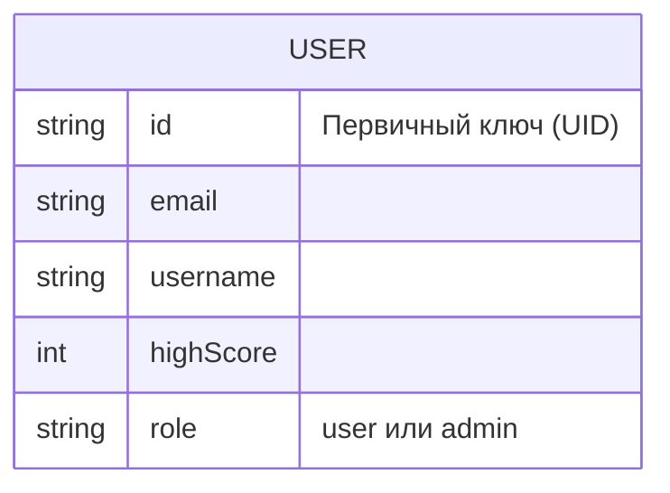

# Игра 2048 - Android-приложение


Реализация классической игры 2048 для Android. Это приложение включает аутентификацию пользователей, глобальную таблицу лидеров и панель администратора для управления пользователями.

## 📱 Возможности

- **Классический игровой процесс 2048**: Основная механика головоломки, которую любят миллионы
- **Аутентификация пользователей**: Безопасная регистрация и вход с помощью Firebase Auth
- **Глобальная таблица лидеров**: Соревнуйтесь с игроками со всего мира и отслеживайте свои лучшие результаты
- **Панель администратора**: Управление пользователями и результатами (только для администраторов)
- **Адаптивный интерфейс**: Красивый пользовательский интерфейс в стиле Material Design, созданный с помощью Jetpack Compose
- **Игра офлайн**: Играйте без подключения к интернету (функции таблицы лидеров требуют подключения)

## 🛠️ Технический стек

### Фронтенд
- **Kotlin** - Основной язык программирования
- **Jetpack Compose** - Современный инструментарий UI для создания нативного интерфейса

### Бэкенд
- **Firebase Authentication** - Для управления пользователями
- **Cloud Firestore** - NoSQL база данных для хранения пользовательских данных и результатов


## 📊 Модель базы данных

Приложение использует Cloud Firestore в качестве базы данных. Вот структура модели данных:

### Коллекции и документы

- **users**: Коллекция документов пользователей
  - **{userId}**: Документ, содержащий детали пользователя
    - **id**: String (Firebase Auth UID)
    - **email**: String
    - **username**: String
    - **highScore**: Integer
    - **role**: String ("user" или "admin")

### Диаграмма связей сущностей



### Правила безопасности

Правила безопасности Firestore реализуют следующие контроли доступа:

- Любой аутентифицированный пользователь может читать все пользовательские данные (для функционирования таблицы лидеров)
- Пользователи могут записывать только в свой собственный документ (обновлять свой профиль/результат)
- Администраторы имеют доступ на чтение и запись ко всем документам пользователей
- Весь остальной доступ запрещен по умолчанию

## 🔧 Инструкции по установке

### Предварительные требования

- Android Studio Arctic Fox (2021.3.1) или новее
- JDK 17 или выше
- Android SDK 26+ (Android 8.0 Oreo)
- Проект Firebase с включенными Authentication и Firestore

### Шаг 1: Клонирование репозитория

```bash
git clone https://github.com/yourusername/2048-android.git
cd 2048-android
```

### Шаг 2: Настройка Firebase

1. Создайте проект Firebase на [Firebase Console](https://console.firebase.google.com/)
2. Добавьте приложение Android в ваш проект Firebase с именем пакета `com.example.a2048`
3. Загрузите файл `google-services.json` и поместите его в директорию `app/`
4. Включите метод входа по Email/Password в Firebase Authentication
5. Настройте базу данных Firestore со следующими правилами безопасности:

```
rules_version = '2';
service cloud.firestore {
  match /databases/{database}/documents {
    // Allow any authenticated user to read the leaderboard data
    match /users/{userId} {
      // Users can read all other users' data (for leaderboard)
      allow read: if request.auth != null;
      
      // Users can only write to their own document
      allow write: if request.auth != null && request.auth.uid == userId;
      
      // Admin users can read and write all user documents
      allow read, write: if request.auth != null && 
        exists(/databases/$(database)/documents/users/$(request.auth.uid)) &&
        get(/databases/$(database)/documents/users/$(request.auth.uid)).data.role == 'admin';
    }
    
    // Deny all other access by default
    match /{document=**} {
      allow read, write: if false;
    }
  }
}
```

### Шаг 3: Сборка и запуск

1. Откройте проект в Android Studio
2. Синхронизируйте файлы Gradle
3. Соберите и запустите проект на эмуляторе или физическом устройстве

### Шаг 4: Создание пользователя-администратора

Для создания пользователя-администратора:
1. Зарегистрируйте пользователя через приложение
2. Перейдите в консоль Firebase Firestore
3. Найдите документ пользователя в коллекции "users"
4. Отредактируйте поле "role" и измените его с "user" на "admin"

## 📂 Структура проекта

```
app/
├── src/
│   ├── main/
│   │   ├── java/com/example/a2048/
│   │   │   ├── data/
│   │   │   │   ├── game/          # Игровая логика
│   │   │   │   ├── model/         # Модели данных
│   │   │   │   └── repository/    # Репозитории данных
│   │   │   ├── di/                # Внедрение зависимостей
│   │   │   ├── ui/
│   │   │   │   ├── navigation/    # Компоненты навигации
│   │   │   │   ├── screens/       # Экраны приложения
│   │   │   │   │   ├── admin/     # Экраны панели администратора
│   │   │   │   │   ├── auth/      # Экраны входа/регистрации
│   │   │   │   │   ├── game/      # Экран игры
│   │   │   │   │   ├── leaderboard/ # Экран таблицы лидеров
│   │   │   │   │   └── splash/    # Сплеш-экран
│   │   │   │   └── theme/         # UI тема и стили
│   │   │   ├── GameApplication.kt # Класс приложения
│   │   │   └── MainActivity.kt    # Точка входа
│   │   └── res/                   # Ресурсы
│   └── androidTest/               # Инструментальные тесты
└── build.gradle.kts              # Файл сборки уровня приложения
```